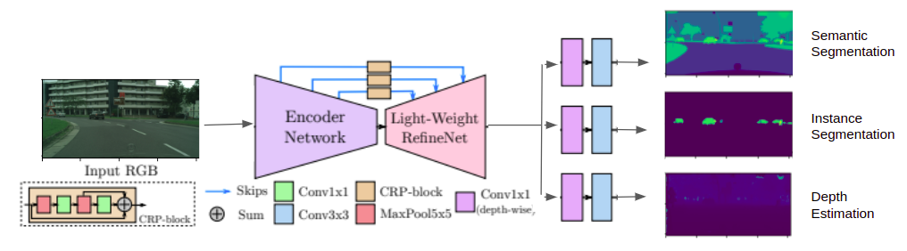
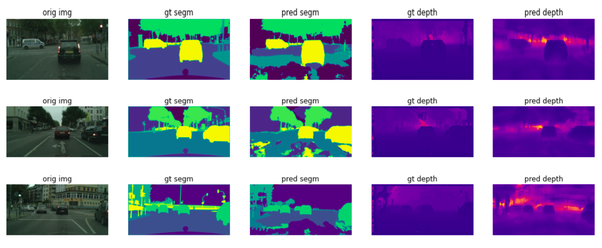
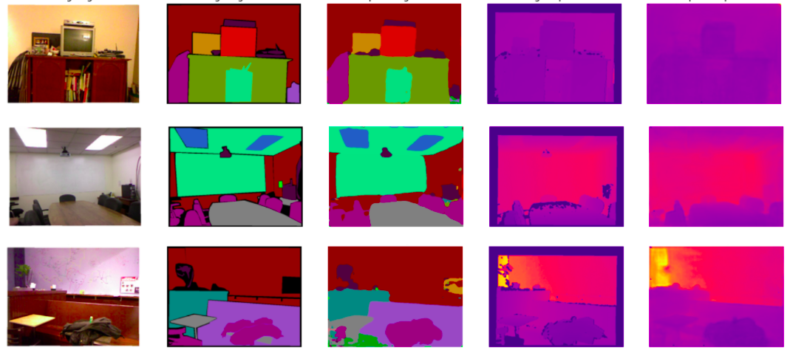

# Multi Task Learning for simultaneous Semantic Segmentation, Instance Segmentation and Depth Estimation

Course Project for Deep Learning (Worcester Polytechnic Institute)

##### Work on progress!! Instance head development in "inseg" branch
This repository heavily depends on the work mentioned in the references section.

#### How to run:
1. The dataset should be downloaded from the following links and placed in a directory named cityscapes
    1. https://www.cityscapes-dataset.com/file-handling/?packageID=1
    2. https://www.cityscapes-dataset.com/file-handling/?packageID=3
    3. https://www.cityscapes-dataset.com/file-handling/?packageID=7 <br/> 
2. To run training script
```
Python train_cityscapes.py
```
3. To run inference script
```
Python inference_cityscapes.py
```
#### Methodology:



This code works with both NYUD and Cityscapes at the moment. 
#### Current Results:
###### Cityscapes


###### NYUD


#### Team:
1. Bharath Kumar Ramesh Babu 
2. Ghokulji Selvaraj 
3. Durga Prakash Karuppannan  
4. Krishna Sathwik Durgaraju 

#### References
1. [Real-Time Joint Semantic Segmentation and Depth Estimation Using Asymmetric Annotations
](https://github.com/DrSleep/multi-task-refinenet "Real-Time Joint Semantic Segmentation and Depth Estimation Using Asymmetric Annotations
")
2. [Semantic Instance Segmentation with a Discriminative Loss Function](https://github.com/nyoki-mtl/pytorch-discriminative-loss "Semantic Instance Segmentation with a Discriminative Loss Function")
